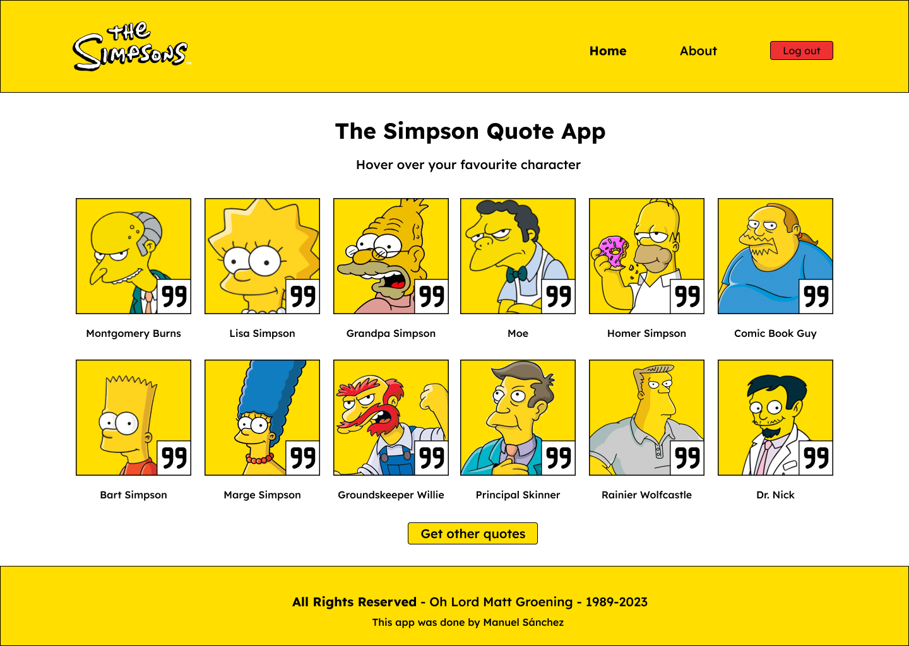

# 🟡 The Simpsons Quote App

Simple application done to show easy implementation with Qwik

## 💾 API and images

- 01: [API and images The Simpsons Quote App](https://thesimpsonsquoteapi.glitch.me/quotes)
